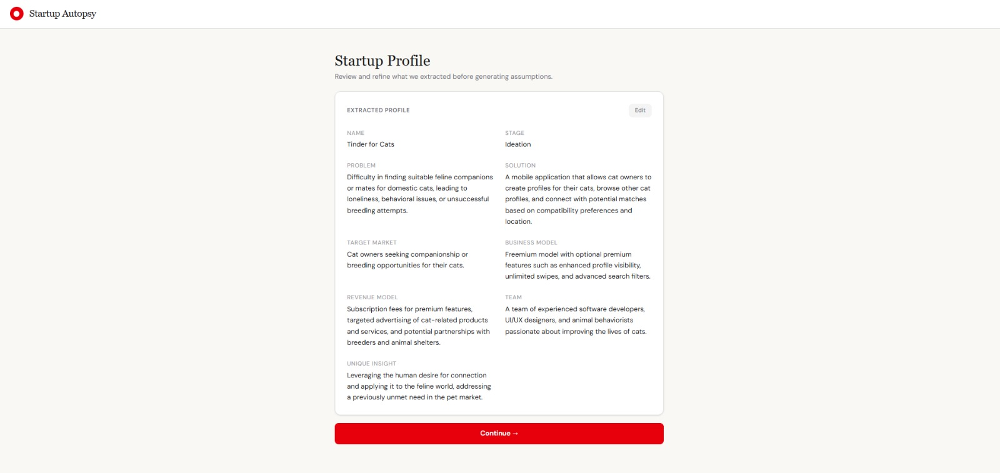
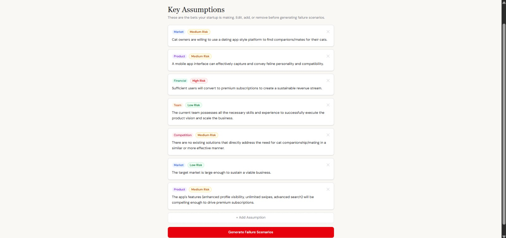
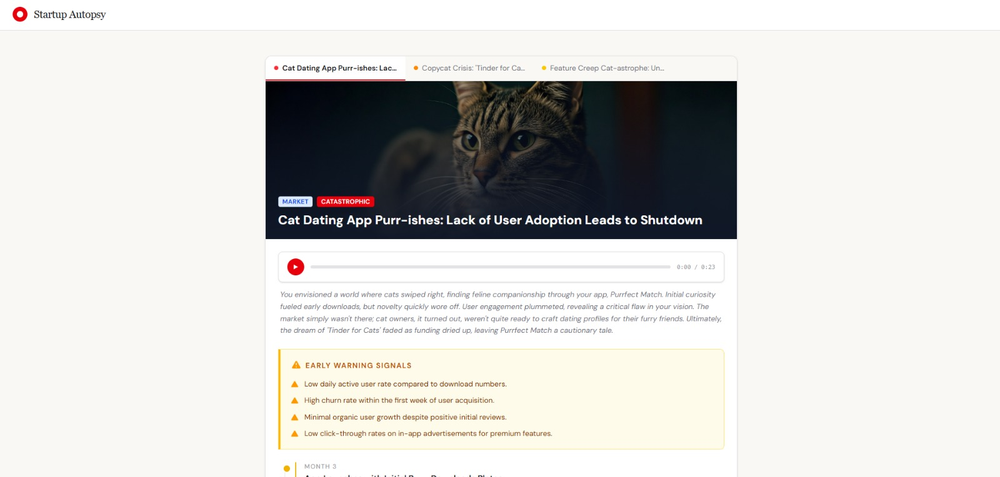
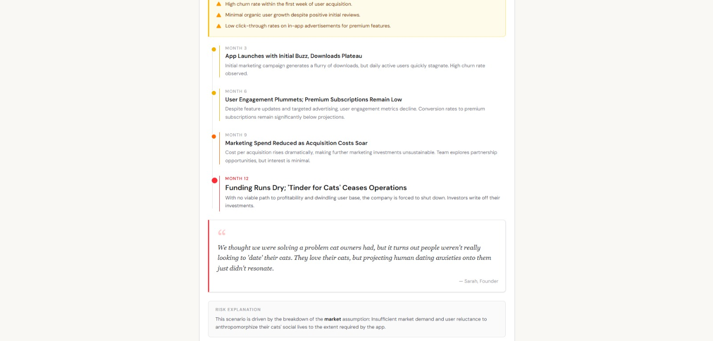

# 🔬 Startup Autopsy

> *What if you could see your startup's failure before it happened?*

Most startups don't die from bad luck. They die from the same silent killers — wrong market, wrong timing, wrong assumptions — that nobody caught early enough. **Startup Autopsy** gives founders a mirror to look into the future.

Video Link

---

# The Problem

Every year, thousands of founders pour months (and millions) into ideas that fail for predictable reasons.

The painful part? Most of those reasons were visible from day one — in the pitch, in the assumptions, in the market signals. But there's no tool that stress-tests your idea **before you build it**.

Advisors are expensive. Feedback is biased. And post-mortems only happen after the damage is done.

---

# The Solution

**Startup Autopsy** is a multimodal AI agent that reads your startup like an investor, thinks like a skeptic, and writes like a documentary filmmaker.

You feed it your idea — a description, a pitch deck, screenshots, whatever you have — and it generates a **future post-mortem**: a plausible, detailed simulation of *how* and *why* your startup could fail, and what early signals you should be testing right now.

Think of it as a **stress test for your conviction.**

---

# How It Works

1. **Input your startup**

   Paste your idea description, upload your pitch deck, or drop in screenshots of your product or landing page.

2. **The agent analyzes**

   It processes your inputs across multiple dimensions:

   - Market assumptions  
   - Competitive landscape  
   - Team blind spots  
   - Go-to-market risks  
   - Timing

3. **Get your autopsy**

   A narrative **post-mortem simulation** that walks through the plausible failure arc of your startup, written in the style of a documentary.

   Not to scare you — **to sharpen you.**

4. **Extract early signals**

   Every autopsy ends with the **specific assumptions you must validate** before going further.

---

# Why This Approach

Most feedback tools give you:

- a score  
- a checklist  
- generic “risks to consider”

That’s not how humans internalize truth.

**Stories do.**

When you read a post-mortem written about *your* startup — even a simulated one — it hits differently. It forces you to confront the version of events you’ve been avoiding.

The insight behind **Startup Autopsy**:

> **Narrative is a stronger forcing function than analysis.**

---

# Screenshots






# Tech Stack

- **Frontend** — React + TypeScript (Vite)
- **AI Agent** — Multimodal Claude (text + vision)
- **AI Platform** — Vertex AI (Google Cloud)
- **Deployment** — Docker-ready

---

# Getting Started

```bash
# Clone the repo
git clone https://github.com/anshi312/startup-autopsy.git

cd startup-autopsy

# Install dependencies
npm install

# Start the dev server
npm run dev

## Vertex AI Authentication (Docker Setup)

This project uses **Google Vertex AI with Application Default Credentials (ADC)**.  
Instead of API keys, the container uses your local Google Cloud authentication.

---

### 1. Host Setup (One-time)

Run these commands **on your computer (not inside Docker)** to generate the credentials file.

| Action | Windows (PowerShell) | Mac (Terminal) |
|------|------|------|
| Login | `gcloud init` | `gcloud init` |
| Generate Credentials | `gcloud auth application-default login` | `gcloud auth application-default login` |
| Verify File | `Test-Path "${env:APPDATA}\gcloud\application_default_credentials.json"` | `ls ~/.config/gcloud/application_default_credentials.json` |

This creates the **Application Default Credentials file** used by Vertex AI.

---

### 2. Run Docker Container

Mount the Google Cloud credentials directory into the container.

#### Windows (PowerShell)

```powershell
docker run -it `
  -p 8080:8080 `
  -v "${env:APPDATA}\gcloud:/root/.config/gcloud" `
  -e GOOGLE_APPLICATION_CREDENTIALS=/root/.config/gcloud/application_default_credentials.json `
  your-image-name


#### Mac / Linux / Unix based system

``` docker run -it \
  -p 8080:8080 \
  -v "$HOME/.config/gcloud:/root/.config/gcloud" \
  -e GOOGLE_APPLICATION_CREDENTIALS=/root/.config/gcloud/application_default_credentials.json \
  your-image-name
